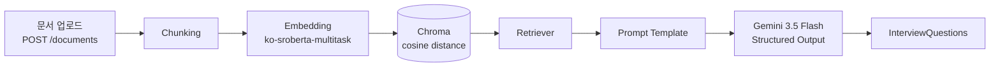

# ai-interview-coach

> RAG 시스템을 설계하고, 검색 품질과 Faithfulness 문제를 실험으로 검증하며 AI 면접 코치 서비스를 구현 중입니다. (Retrieval ✅ · Question Generation ✅ · Answer Evaluation 🚧 · RAG Evaluation ⏳ — 자세한 진행 상황은 [Roadmap](#roadmap) 참고)

RAG 기반 AI 면접 코치 — 사용자의 이력서·포트폴리오 문서를 기반으로 개인화된 기술 면접 질문을 생성하고, 답변을 평가하는 서비스입니다.

## Why this project?

이 프로젝트는 GPT-style Transformer를 PyTorch로 직접 구현한 [`korean-chatbot`](https://github.com/jiyoung720/korean-chatbot) 프로젝트의 후속작입니다.

- **`korean-chatbot`** — LLM 엔진 내부(Transformer, 토크나이저, 학습 루프)를 직접 구현하는 경험
- **`ai-interview-coach`** — 기성 LLM(Gemini API)을 활용해 실제 서비스를 설계·구축·서빙·평가하는 경험

두 프로젝트를 함께 보면 "모델 내부를 이해하는 능력"과 "실제 서비스를 만드는 능력"을 둘 다 보여줄 수 있도록 의도적으로 분리했습니다.

### Why RAG, not fine-tuning?

사용자마다 업로드하는 문서가 다르고 계속 바뀌기 때문에, 매번 파인튜닝하는 건 비용·시간 면에서 현실적이지 않습니다. 그래서 모델 가중치는 고정하고, 사용자 문서를 Vector DB에 저장한 뒤 검색해서 Gemini에 컨텍스트로 제공하는 구조로 설계했습니다. 이 구조는 사용자가 늘어나도 그대로 확장되고, 어떤 질문이 어떤 문서에서 나왔는지도 추적할 수 있습니다.

## Example Output

**Input**

```bash
curl -X POST http://127.0.0.1:8000/generate-question \
  -H "Content-Type: application/json" \
  -d '{"query": "JWT 관련 경험"}'
```

**Output**

```json
{
  "questions": [
    "FastAPI의 비동기(async/await) 처리 방식이 RAG 기반 면접 질문 생성 과정에서 대기 시간을 줄이는 데 어떻게 기여할 수 있는지 설명해 주세요.",
    "JWT를 이용한 사용자 인증을 구현할 때 토큰 탈취에 대비한 보안 강화 전략과 Access Token 및 Refresh Token의 구체적인 관리 방안에 대해 설명해 주세요.",
    "비밀번호 해싱에 bcrypt를 사용하셨는데 일반적인 단방향 해시 함수와 비교했을 때 bcrypt가 가지는 강점과 솔팅(Salting) 및 키 스트레칭(Key Stretching)의 원리를 설명해 주세요.",
    "사용자가 업로드한 이력서와 포트폴리오를 RAG 시스템에서 활용하기 위해 텍스트 전처리, 임베딩, 그리고 벡터 데이터베이스(Vector DB)로 저장하는 전체적인 데이터 파이프라인을 어떻게 설계하셨는지 설명해 주세요.",
    "RAG 시스템의 검색 정확도를 높이기 위해 문서 청킹(Chunking) 단위를 어떻게 설정하셨으며 검색(Retrieval) 성능을 향상시키기 위해 적용할 수 있는 기법에는 무엇이 있는지 설명해 주세요."
  ]
}
```

대부분의 질문이 업로드된 문서의 실제 기술 스택(FastAPI, JWT, bcrypt, PostgreSQL)에 근거하여 생성되는 것을 확인했습니다. 다만 Day 2 실험 과정에서 문서에 없는 내용을 생성하는 Faithfulness 문제도 발견했으며, 이는 RAGAS 평가 단계에서 추가 검증할 예정입니다 (자세한 내용은 [Key Findings](#key-findings) 참고).

## Architecture



> Chain B(답변 평가)는 Phase 3에서 구축 중입니다 — Interview KB Retriever가 별도 컬렉션으로 추가되고, Question + Answer + KB context가 Gemini Judge로 들어가는 구조입니다.

## Key Findings

코드를 짜는 과정에서 발견한 것들 — 단순히 "작동한다"가 아니라 "왜 그렇게 작동하는지"를 확인한 실험들입니다. 전체 내용은 [실험 로그](docs/experiment_log.md)에 있습니다.

- **혼합 주제 chunk는 유사도 점수를 왜곡시킬 수 있음** — 여러 주제가 섞인 긴 chunk가 단일 주제의 짧은 chunk보다 더 높은 유사도를 받는 경우를 실측으로 확인. → KB는 파일당 주제 하나로 작성.
- **Retriever 성공 ≠ Faithfulness 보장** — 검색이 정확해도 생성 모델이 컨텍스트 밖 내용을 추가할 수 있음을 직접 확인. → RAGAS에 Faithfulness 포함.

## Tech Stack

- **Backend**: FastAPI
- **Framework**: LangChain (LCEL)
- **Vector DB**: Chroma (`hnsw:space=cosine`)
- **Embedding**: `ko-sroberta-multitask`
- **LLM**: Gemini 3.5 Flash (structured output)
- **Evaluation (Planned)**: RAGAS, LLM-as-a-Judge

## Roadmap

### Phase 1 — Retrieval (완료)
- [x] 문서 업로드 API (`POST /documents`)
- [x] Chunking + Embedding + Chroma 인덱싱 (dedup 포함)
- [x] Semantic Retrieval 검증 (키워드 매칭이 아닌 의미 기반 검색 확인)

### Phase 2 — Question Generation (완료)
- [x] Gemini API 연동 (단계별 검증: Gemini 단독 → Prompt 단독 → Retriever+Prompt → 전체 체인)
- [x] Structured Output으로 응답 형식 고정 (`InterviewQuestions`)
- [x] `POST /generate-question` 엔드포인트

### Phase 3 — Answer Evaluation (거의 완료)
- [x] Interview KB 구축 (`jwt.md`, `fastapi.md` 최소 구성)
- [x] Chain B (Gemini Judge 기반 답변 평가, retrieved_sources 포함)
- [x] `POST /evaluate-answer` 엔드포인트
- [ ] Judge Calibration 자동화 (17개 셋, 수동 검증 1건만 완료)

### Phase 4 — Evaluation
- [ ] RAGAS (Faithfulness, Context Precision)
- [ ] Embedding 비교 실험 (`ko-sroberta-multitask` vs Gemini Embedding)

## API

### `POST /documents`
```bash
curl -X POST http://127.0.0.1:8000/documents -F "file=@tests/fixtures/sample_user_doc.md"
```

### `POST /generate-question`
```bash
curl -X POST http://127.0.0.1:8000/generate-question \
  -H "Content-Type: application/json" \
  -d '{"query": "JWT 관련 경험"}'
```
응답: `{"questions": ["...", "...", ...]}`

## 실행 방법

```bash
python3.12 -m venv .venv
source .venv/bin/activate
pip install -r requirements.txt
cp .env.example .env  # GEMINI_API_KEY 채우기
uvicorn app.main:app --reload
```

## 문서

- [프로젝트 명세서](docs/project_spec_v1.md)
- [실험 로그](docs/experiment_log.md)