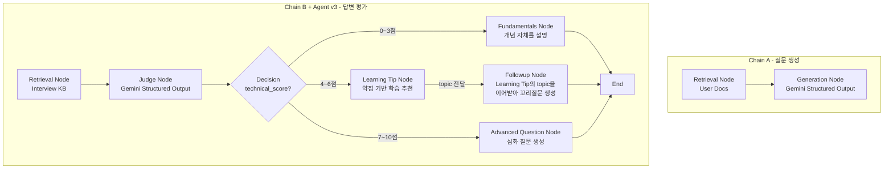

# ai-interview-coach

[](https://github.com/jiyoung720/ai-interview-coach/actions/workflows/ci.yml)

사용자의 이력서·포트폴리오 문서를 기반으로 개인화된 기술 면접 질문을 생성하고, 답변을 평가하는 RAG 기반 AI 면접 코치 서비스입니다.

> 단순히 RAG를 구현하는 데 그치지 않고, Retrieval·Faithfulness·Judge Calibration을 실험으로 검증하며 설계를 반복 개선했습니다. LangGraph 기반 Agent로 확장한 뒤에도 동일한 검증 방식을 유지했습니다. (자세한 진행 상황은 [Project Outcomes](#project-outcomes) 참고)

## Why this project?

이 프로젝트는 GPT-style Transformer를 PyTorch로 직접 구현한 [`korean-chatbot`](https://github.com/jiyoung720/korean-chatbot) 프로젝트의 후속작입니다.

- **`korean-chatbot`**: LLM 엔진 내부(Transformer, 토크나이저, 학습 루프)를 직접 구현하는 경험
- **`ai-interview-coach`**: 기성 LLM(Gemini API)을 활용해 실제 서비스를 설계·구축·서빙·평가하는 경험

두 프로젝트를 함께 보면 "모델 내부를 이해하는 능력"과 "실제 서비스를 만드는 능력"을 둘 다 보여줄 수 있도록 의도적으로 분리했습니다.

### Why RAG, not fine-tuning?

사용자마다 업로드하는 문서가 다르고 계속 바뀌기 때문에, 매번 파인튜닝하는 건 비용·시간 면에서 현실적이지 않습니다. 그래서 모델 가중치는 고정하고, 사용자 문서를 Vector DB에 저장한 뒤 검색해서 Gemini에 컨텍스트로 제공하는 구조로 설계했습니다. 이 구조는 사용자가 늘어나도 그대로 확장되고, 어떤 질문이 어떤 문서에서 나왔는지도 추적할 수 있습니다.

## Example Output

**질문 생성**
```bash
curl -X POST http://127.0.0.1:8000/generate-question \
  -H "Content-Type: application/json" \
  -d '{"query": "JWT 관련 경험"}'
```
```json
{"questions": ["FastAPI의 비동기(async/await) 처리 방식이 ...", "JWT를 이용한 사용자 인증을 구현할 때 ...", "..."]}
```

**답변 평가 + Agent 분기 (technical_score 구간에 따라 서로 다른 코칭을 반환)**
```bash
curl -X POST http://127.0.0.1:8000/evaluate-answer \
  -H "Content-Type: application/json" \
  -d '{"question": "JWT란 무엇인가?", "answer": "잘 모르겠습니다."}'
```
```json
{
  "technical_score": 0,
  "completeness_score": 0,
  "improvements": ["JWT의 개념과 구성 요소에 대한 학습이 필요합니다.", "..."],
  "retrieved_sources": ["jwt.md", "oauth.md"],
  "next_action": "fundamentals_explained",
  "concept_explanation": {
    "concept": "JWT (JSON Web Token)",
    "explanation": "JWT는 사용자 인증 정보를 안전하게 전달하기 위한 토큰 기반 인증 방식입니다. 점(.)으로 구분된 Header, Payload, Signature 세 부분으로 구성됩니다. ...",
    "key_points": ["Header/Payload/Signature 3단 구조", "..."]
  },
  "learning_tip": null,
  "followup_question": null,
  "advanced_question": null
}
```

0점이라 개념 자체를 모르는 상태로 판단해, 학습 방향 제시(Learning Tip) 대신 **개념 설명**을 반환했습니다. 같은 질문에 부분적으로만 맞는 답변(5점)을 보내면 `learning_tip` + `followup_question`이, 정확한 답변(10점)을 보내면 `advanced_question`(심화 질문)이 채워집니다. `next_action`으로 어느 경로가 실행됐는지 알 수 있습니다.

4~6점 경로에서는 `learning_tip.topic`과 `followup_question`이 같은 주제를 겨냥합니다. Learning Tip이 먼저 핵심 약점을 정하고 Followup이 그 결과를 이어받는 순차 구조이기 때문입니다.

Faithfulness 문제(컨텍스트에 없는 내용을 생성하는 것)를 실측으로 발견한 뒤, RAGAS로 정량화했습니다. 자세한 수치는 [Key Findings](#key-findings) 참고.

## Architecture



**technical_score 구간에 따라 세 갈래 중 하나가 실행됩니다.** 고정된 파이프라인이 아니라, State(evaluation_result)에 따라 다음 행동이 갈리는 것이 이 프로젝트의 Agent 형태입니다.

분기를 설계할 때 기준으로 삼은 것은 "갈래 수를 늘리자"가 아니라 **"점수대마다 필요한 코칭의 종류가 다르다"**였습니다. 개념을 아예 모르는 사람(0~3점)에게 "이걸 공부하세요"라는 학습 팁은 도움이 되지 않아 개념 설명을 주고, 이미 정확히 답한 사람(7~10점)에게는 보완할 약점이 없으니 코칭 대신 더 깊은 질문을 던집니다. v2까지는 5점 이상이면 아무 노드도 실행되지 않아 한쪽 경로가 비어 있었는데, 이 확장으로 모든 점수대에서 결과가 나옵니다.

4~6점 경로에서 Learning Tip과 Followup을 병렬이 아닌 순차로 설계한 이유는 이렇습니다. 두 노드가 같은 약점(improvements)을 각자 독립적으로 해석하면 서로 다른 부분을 짚을 위험이 있어, Learning Tip이 먼저 핵심 주제(topic)를 정하고 Followup이 그 결과를 이어받도록 했습니다.

두 체인 모두 LangChain LCEL로 먼저 구현한 뒤, LangGraph StateGraph로 마이그레이션했습니다. Retrieval과 Judge/Generation을 별도 Node로 분리해 (1) 문제 발생 시 어느 단계인지 바로 특정할 수 있고, (2) 평가 점수에 따른 조건부 분기(Agent)를 Node 단위로 추가할 수 있도록 설계했습니다. 기존 LCEL 코드(`rag/chains.py`)는 삭제하지 않고 그대로 보존해, Migration 과정 자체를 코드로 증명할 수 있게 했습니다.

## Key Findings

코드를 짜는 과정에서 발견한 것들입니다. 단순히 "작동한다"가 아니라 "왜 그렇게 작동하는지"를 확인한 실험들입니다. 전체 내용은 [실험 로그](docs/experiment_log.md)에 있습니다.

- **Retrieval 관련 실험들이 모두 같은 결론으로 수렴함**: Semantic Retrieval 검증(Day 1), Context Precision 단독 실험, 첫 Embedding 비교, KB 확장 후 재실험까지 서로 다른 목적의 실험에서도 동일한 패턴이 반복적으로 관찰됨. KB가 2개 문서일 때는 Context Precision과 Embedding 비교가 항상 만점이라 변별력을 갖지 못했고, 11개로 확장한 뒤에야 Retrieval 관련 지표들이 실제 차이를 드러내기 시작함.
- **혼합 주제 chunk는 유사도 점수를 왜곡시킬 수 있음**: 여러 주제가 섞인 긴 chunk가 단일 주제의 짧은 chunk보다 더 높은 유사도를 받는 경우를 실측으로 확인. KB는 파일당 주제 하나로 작성하도록 반영.
- **문서 분리의 단위는 파일 크기가 아니라 "완결된 근거 단위(retrieval unit)"**: Retrieval 전용 평가셋(20문항)으로 재검증한 결과, 독립된 개념이 나열된 문서(`postgresql.md`, `spring.md`)는 하위 주제별로 분리할수록 검색 품질이 개선됐지만, 비교형 문서(`session_vs_token.md`)는 반대로 정의·차이·확장성 비교를 한 chunk에 유지해야 품질이 좋아짐을 확인. 이 원칙을 반영해 KB를 재구성한 뒤 Top-1 정확도 100%(20/20), Faithfulness 0.9708, Context Precision 1.0000까지 개선.
- **Retriever 성공이 Faithfulness를 보장하지는 않음**: 검색이 정확해도 생성 모델이 컨텍스트 밖 내용을 추가할 수 있음을 직접 확인. RAGAS로 정량화한 결과, Calibration Set 17개 케이스의 평균 Faithfulness는 0.4412. bad/average 카테고리에서 편차가 크게 나타나 Judge의 technical_score와는 다른 것을 측정하는 지표임을 확인.
- **임베딩 비교 결론이 표본 확대 후 뒤집힘**: KB가 2개 문서였을 때는 두 임베딩이 항상 동일했고, 11개로 확장한 뒤 5문항 표본에서는 Gemini Embedding이 더 안정적으로 관찰됐음(다만 표본이 작아 일반화는 보류). Retrieval Unit 재설계로 KB를 18개로 재구성한 뒤 20문항 평가셋으로 재실행하자 정반대로 `ko-sroberta-multitask`가 Top-1 100%(20/20)·Faithfulness 0.9708로 Gemini Embedding(95.0%·0.9500)보다 근소하게 우세했음. 작은 표본에서의 결론을 그대로 일반화하면 안 된다는 것을 직접 확인한 사례.
- **Judge Calibration으로 프롬프트/테스트 데이터 결함을 구분해냄**: Judge 채점을 그대로 신뢰하지 않고 Calibration Set(17개)으로 검증. 실패 원인을 분석한 결과 Judge가 아니라 Calibration Set 자체의 설계 결함(동일 답변에 서로 다른 기대치 부여)이 원인이었음을 발견, 재설계를 통해 정확도를 52.9%에서 94.1%로 향상시킴.
- **LangGraph 마이그레이션 검증에 Calibration Set을 회귀 테스트로 재사용**: LCEL에서 LangGraph로 Migration한 이후에도 기존 Judge 동작이 유지되는지 확인하기 위해, 그래프로 옮긴 뒤 동일한 Calibration Set을 재실행(88.2%)함. 실패 케이스가 LCEL 버전에서도 존재했던 경계선 변동과 동일함을 확인했고, 마이그레이션이 새로운 오분류를 만들지 않았음을 검증.
- **라우팅 로직을 순수 함수로 분리해두면 LLM 호출 없이 전수 검증이 가능함**: Agent를 점수 구간별 3분기로 확장할 때, 분기 함수(`decide_next_step`)가 State만 받는 순수 함수라 Gemini 호출 없이 0~10점 11개 값을 전부 검증할 수 있었음. 이전 경계값 검증(Agent v1)에서는 특정 점수가 나오는 답변을 LLM으로 만들어내야 해서 0/5/10 세 지점만 확인했던 것과 대비됨. 노드와 라우팅을 분리한 구조의 실질적 이점.
- **Agent 확장 시 병렬보다 순차가 나은 경우가 있음**: Learning Tip과 Followup을 처음엔 병렬 노드로 설계했으나, 두 노드가 같은 약점(improvements)을 각자 독립적으로 해석하면 서로 다른 부분을 짚을 위험을 발견. Learning Tip이 먼저 topic을 정하고 Followup이 그 결과를 이어받는 순차 구조로 변경해, 두 출력이 항상 같은 주제를 가리키도록 함.

## Tech Stack
 
- **Backend**: FastAPI
- **패키지 관리**: uv
- **Framework**: LangChain (LCEL) → LangGraph (StateGraph) 마이그레이션
- **Vector DB**: Chroma (`hnsw:space=cosine`), Interview KB 18개 문서 (retrieval unit 기준으로 재구성)
- **Embedding**: `ko-sroberta-multitask` (기본), Gemini Embedding(`gemini-embedding-001`, 비교 실험용)
- **LLM**: Gemini 3.5 Flash (structured output)
- **Evaluation**: Semantic Retrieval Test, Judge Calibration Set(94.1%), RAGAS Faithfulness(Calibration Set 기준 평균 0.4412), Retrieval 전용 평가셋(20문항: Top-1 100%·Faithfulness 0.9708·Context Precision 1.0000), Embedding 비교(20문항 기준: ko-sroberta 100%/0.9708 > Gemini Embedding 95%/0.9500, ko-sroberta 최종 채택)

## Project Outcomes

- Semantic Retrieval, Faithfulness, Judge Calibration을 실험으로 검증하며 설계를 반복 개선
- LangChain LCEL 기반 RAG(Retrieval → Generation/Judge)를 LangGraph StateGraph로 마이그레이션
- Judge Calibration Set(17개)으로 평가 로직을 검증하고, 이를 마이그레이션 회귀 테스트로 재사용
- Retrieval / Judge / Generation을 독립적인 Graph Node로 분리해 디버깅 가능성과 확장성 확보
- technical_score 기반 Agent를 구현하고, Learning Tip이 생성한 topic을 Followup이 이어받도록 설계하여 Agent 출력의 일관성을 확보
- Agent를 점수 구간별 3분기(개념 설명 / 약점 코칭 / 심화 질문)로 확장해 모든 점수대에서 결과가 나오도록 개선. 라우팅 로직은 순수 함수로 분리해 LLM 호출 없이 0~10점 전 구간을 전수 검증
- RAGAS(Faithfulness, Context Precision)를 도입하고, KB 규모(2개에서 11개로)가 지표 변별력에 미치는 영향을 실험으로 확인
- 동일 KB에 두 임베딩(`ko-sroberta-multitask`, Gemini Embedding)을 각각 인덱싱해 비교 실험 파이프라인 구축
- Retrieval 전용 평가셋(20문항)을 구축하고, 문서 분리 전략을 "완결된 근거 단위" 기준으로 재설계해 Top-1 정확도 100%·Faithfulness 0.9708까지 개선
- Embedding 비교를 20문항 평가셋으로 재실행한 결과, 기존 5문항 표본(Gemini 우세) 결론이 뒤집혀 ko-sroberta-multitask가 Top-1 100%·Faithfulness 0.9708로 근소 우세해 최종 임베딩으로 채택

## API

### `POST /documents`
```bash
curl -X POST http://127.0.0.1:8000/documents -F "file=@tests/fixtures/sample_user_doc.md"
```

### `POST /generate-question`
```bash
curl -X POST http://127.0.0.1:8000/generate-question \
  -H "Content-Type: application/json" \
  -d '{"query": "JWT 관련 경험"}'
```
응답: `{"questions": ["...", "...", ...]}`

### `POST /evaluate-answer`
```bash
curl -X POST http://127.0.0.1:8000/evaluate-answer \
  -H "Content-Type: application/json" \
  -d '{"question": "JWT란 무엇인가?", "answer": "..."}'
```
응답: `{"technical_score": ..., "completeness_score": ..., "strengths": [...], "improvements": [...], "overall_feedback": "...", "retrieved_sources": [...], "next_action": "...", "concept_explanation": {...} | null, "learning_tip": {...} | null, "followup_question": "..." | null, "advanced_question": {...} | null}`

`technical_score` 구간에 따라 셋 중 하나의 경로만 실행되고, 나머지 필드는 `null`입니다.

| 점수 | `next_action` | 채워지는 필드 |
|---|---|---|
| 0~3 | `fundamentals_explained` | `concept_explanation` (concept, explanation, key_points) |
| 4~6 | `followup_generated` | `learning_tip` (topic, reason, recommended_sections) + `followup_question` |
| 7~10 | `advanced_question_generated` | `advanced_question` (question, intent) |

`followup_question`은 `learning_tip.topic`을 이어받아 동일 주제를 겨냥합니다.

## 실행 방법

### 로컬
```bash
uv sync
cp .env.example .env  # GEMINI_API_KEY 채우기
uv run uvicorn app.main:app --reload
```

### Docker
```bash
cp .env.example .env  # GEMINI_API_KEY 채우기
docker compose up -d
```
최초 기동 시 Interview KB가 자동으로 인덱싱되고(18개 문서, 29 chunk), 이후 재시작에서는 volume에 남아 있는 인덱스를 그대로 사용합니다. `chroma_db`와 업로드 파일은 volume에 보존되며, `GEMINI_API_KEY`는 이미지에 포함되지 않고 런타임에 주입됩니다.

이미지는 CPU 전용 torch를 사용해 3.79GB입니다(amd64 기준 2.7GB). 기본 설정으로 빌드하면 배포 대상에 없는 GPU용 CUDA 스택이 3.5GB가량 포함되어 10.9GB가 되는데, 이를 Dockerfile 안에서만 걷어냈습니다. 로컬(macOS)과 Colab(GPU 사용) 환경은 영향을 받지 않도록 `pyproject.toml`은 수정하지 않았습니다.

### CI/CD

`main` 브랜치에 푸시하면 GitHub Actions가 다음을 자동 수행합니다.

```
push → test (회귀 테스트 22개) → docker-build (이미지 빌드 + 스모크 테스트) → deploy (EC2 배포)
```

- **test**: 분기 로직, 그래프 구조, chunking 등 Gemini API 키가 필요 없는 계층만 검증합니다. 비밀값을 CI에 노출하지 않기 위한 설계이며, 마침 회귀가 가장 나기 쉬운 부분(Agent 분기)이 이 범위에 들어옵니다.
- **docker-build**: 깨끗한 환경(linux/amd64)에서 빌드되는지 확인하고, CUDA 패키지가 다시 섞이면 실패 처리합니다. 실제로 CPU torch 최적화가 에러 없이 적용되지 않았던 적이 있어 자동 검사로 고정했습니다.
- **deploy**: 앞의 두 job이 통과한 경우에만 실행됩니다(`needs`). EC2에 SSH로 접속해 재기동한 뒤, 외부에서 헬스체크로 실제 응답까지 확인합니다.

## 문서

- [프로젝트 명세서](docs/project_spec_v1.md): Phase별 상세 진행 상황(Roadmap) 포함
- [실험 로그](docs/experiment_log.md)