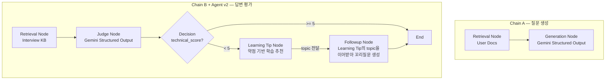

# ai-interview-coach

사용자의 이력서·포트폴리오 문서를 기반으로 개인화된 기술 면접 질문을 생성하고, 답변을 평가하는 RAG 기반 AI 면접 코치 서비스입니다.

> 단순히 RAG를 구현하는 데 그치지 않고, Retrieval·Faithfulness·Judge Calibration을 실험으로 검증하며 설계를 반복 개선했습니다. LangGraph 기반 Agent로 확장한 뒤에도 동일한 검증 방식을 유지했습니다. (자세한 진행 상황은 [Project Outcomes](#project-outcomes) 참고)

## Why this project?

이 프로젝트는 GPT-style Transformer를 PyTorch로 직접 구현한 [`korean-chatbot`](https://github.com/jiyoung720/korean-chatbot) 프로젝트의 후속작입니다.

- **`korean-chatbot`** — LLM 엔진 내부(Transformer, 토크나이저, 학습 루프)를 직접 구현하는 경험
- **`ai-interview-coach`** — 기성 LLM(Gemini API)을 활용해 실제 서비스를 설계·구축·서빙·평가하는 경험

두 프로젝트를 함께 보면 "모델 내부를 이해하는 능력"과 "실제 서비스를 만드는 능력"을 둘 다 보여줄 수 있도록 의도적으로 분리했습니다.

### Why RAG, not fine-tuning?

사용자마다 업로드하는 문서가 다르고 계속 바뀌기 때문에, 매번 파인튜닝하는 건 비용·시간 면에서 현실적이지 않습니다. 그래서 모델 가중치는 고정하고, 사용자 문서를 Vector DB에 저장한 뒤 검색해서 Gemini에 컨텍스트로 제공하는 구조로 설계했습니다. 이 구조는 사용자가 늘어나도 그대로 확장되고, 어떤 질문이 어떤 문서에서 나왔는지도 추적할 수 있습니다.

## Example Output

**질문 생성**
```bash
curl -X POST http://127.0.0.1:8000/generate-question \
  -H "Content-Type: application/json" \
  -d '{"query": "JWT 관련 경험"}'
```
```json
{"questions": ["FastAPI의 비동기(async/await) 처리 방식이 ...", "JWT를 이용한 사용자 인증을 구현할 때 ...", "..."]}
```

**답변 평가 + Agent 분기 (technical_score가 낮으면 꼬리질문 자동 생성)**
```bash
curl -X POST http://127.0.0.1:8000/evaluate-answer \
  -H "Content-Type: application/json" \
  -d '{"question": "JWT란 무엇인가?", "answer": "잘 모르겠습니다."}'
```
```json
{
  "technical_score": 0,
  "completeness_score": 0,
  "improvements": ["JWT의 개념과 구성 요소에 대한 학습이 필요합니다.", "..."],
  "retrieved_sources": ["fastapi.md", "jwt.md"],
  "followup_question": "보통 토큰 기반 인증 시스템에서는 ... Access Token과 Refresh Token을 나누어 사용하는 보안상의 핵심적인 이유는 무엇인가요?"
}
```

대부분의 질문/평가가 문서·KB의 실제 내용에 근거하여 생성되는 것을 확인했습니다. 다만 실험 과정에서 컨텍스트에 없는 내용을 생성하는 Faithfulness 문제도 발견했으며, 이는 RAGAS 평가 단계에서 정량적으로 검증할 예정입니다 (자세한 내용은 [Key Findings](#key-findings) 참고).

## Architecture



**technical_score가 5 미만이면 Agent가 Learning Tip → Followup을 순차로 생성합니다** — 고정된 파이프라인이 아니라, State(evaluation_result)에 따라 다음 행동이 갈리는 것이 이 프로젝트의 Agent 형태입니다. Learning Tip과 Followup을 병렬이 아닌 순차로 설계한 이유: 두 노드가 같은 약점(improvements)을 각자 독립적으로 해석하면 서로 다른 부분을 짚을 위험이 있어, Learning Tip이 먼저 핵심 주제(topic)를 정하고 Followup이 그 결과를 이어받도록 했습니다.

두 체인 모두 LangChain LCEL로 먼저 구현한 뒤, LangGraph StateGraph로 마이그레이션했습니다. Retrieval과 Judge/Generation을 별도 Node로 분리해 (1) 문제 발생 시 어느 단계인지 바로 특정할 수 있고, (2) 평가 점수에 따른 조건부 분기(Agent)를 Node 단위로 추가할 수 있도록 설계했습니다. 기존 LCEL 코드(`rag/chains.py`)는 삭제하지 않고 그대로 보존해, Migration 과정 자체를 코드로 증명할 수 있게 했습니다.

## Key Findings

코드를 짜는 과정에서 발견한 것들 — 단순히 "작동한다"가 아니라 "왜 그렇게 작동하는지"를 확인한 실험들입니다. 전체 내용은 [실험 로그](docs/experiment_log.md)에 있습니다.

- **혼합 주제 chunk는 유사도 점수를 왜곡시킬 수 있음** — 여러 주제가 섞인 긴 chunk가 단일 주제의 짧은 chunk보다 더 높은 유사도를 받는 경우를 실측으로 확인. → KB는 파일당 주제 하나로 작성.
- **Retriever 성공 ≠ Faithfulness 보장** — 검색이 정확해도 생성 모델이 컨텍스트 밖 내용을 추가할 수 있음을 직접 확인. → RAGAS에 Faithfulness 포함.
- **Judge Calibration으로 프롬프트/테스트 데이터 결함을 구분해냄** — Judge 채점을 그대로 신뢰하지 않고 Calibration Set(17개)으로 검증. 실패 원인을 분석한 결과 Judge가 아니라 Calibration Set 자체의 설계 결함(동일 답변에 서로 다른 기대치 부여)이 원인이었음을 발견, 재설계를 통해 정확도를 52.9% → 94.1%로 향상시킴.
- **LangGraph 마이그레이션 검증에 Calibration Set을 회귀 테스트로 재사용** — LCEL → LangGraph Migration 이후에도 기존 Judge 동작이 유지되는지 확인하기 위해, 그래프로 옮긴 뒤 동일한 Calibration Set을 재실행(88.2%)함. 실패 케이스가 LCEL 버전에서도 존재했던 경계선 변동과 동일함을 확인 — 마이그레이션이 새로운 오분류를 만들지 않았음을 검증.
- **Agent 확장 시 병렬보다 순차가 나은 경우가 있음** — Learning Tip과 Followup을 처음엔 병렬 노드로 설계했으나, 두 노드가 같은 약점(improvements)을 각자 독립적으로 해석하면 서로 다른 부분을 짚을 위험을 발견. Learning Tip이 먼저 topic을 정하고 Followup이 그 결과를 이어받는 순차 구조로 변경해, 두 출력이 항상 같은 주제를 가리키도록 함.

## Tech Stack

- **Backend**: FastAPI
- **Framework**: LangChain (LCEL) → LangGraph (StateGraph) 마이그레이션
- **Vector DB**: Chroma (`hnsw:space=cosine`)
- **Embedding**: `ko-sroberta-multitask`
- **LLM**: Gemini 3.5 Flash (structured output)
- **Evaluation**: Semantic Retrieval Test, Judge Calibration Set (완료), RAGAS (예정)

## Project Outcomes

- Semantic Retrieval, Faithfulness, Judge Calibration을 실험으로 검증하며 설계를 반복 개선
- LangChain LCEL 기반 RAG(Retrieval → Generation/Judge)를 LangGraph StateGraph로 마이그레이션
- Judge Calibration Set(17개)으로 평가 로직을 검증하고, 이를 마이그레이션 회귀 테스트로 재사용
- Retrieval / Judge / Generation을 독립적인 Graph Node로 분리해 디버깅 가능성과 확장성 확보
- technical_score 기반 Agent를 구현하고, Learning Tip이 생성한 topic을 Followup이 이어받도록 설계하여 Agent 출력의 일관성을 확보

## API

### `POST /documents`
```bash
curl -X POST http://127.0.0.1:8000/documents -F "file=@tests/fixtures/sample_user_doc.md"
```

### `POST /generate-question`
```bash
curl -X POST http://127.0.0.1:8000/generate-question \
  -H "Content-Type: application/json" \
  -d '{"query": "JWT 관련 경험"}'
```
응답: `{"questions": ["...", "...", ...]}`

### `POST /evaluate-answer`
```bash
curl -X POST http://127.0.0.1:8000/evaluate-answer \
  -H "Content-Type: application/json" \
  -d '{"question": "JWT란 무엇인가?", "answer": "..."}'
```
응답: `{"technical_score": ..., "completeness_score": ..., "strengths": [...], "improvements": [...], "overall_feedback": "...", "retrieved_sources": [...], "learning_tip": {"topic": ..., "reason": ..., "recommended_sections": [...]} | null, "followup_question": "..." | null}`

`technical_score`가 5 미만이면 Agent가 `learning_tip`과 `followup_question`을 순차로 생성합니다 (점수가 충분하면 둘 다 `null`). `followup_question`은 `learning_tip.topic`을 이어받아 동일 주제를 겨냥합니다.

## 실행 방법

```bash
python3.12 -m venv .venv
source .venv/bin/activate
pip install -r requirements.txt
cp .env.example .env  # GEMINI_API_KEY 채우기
uvicorn app.main:app --reload
```

## 문서

- [프로젝트 명세서](docs/project_spec_v1.md) — Phase별 상세 진행 상황(Roadmap) 포함
- [실험 로그](docs/experiment_log.md)