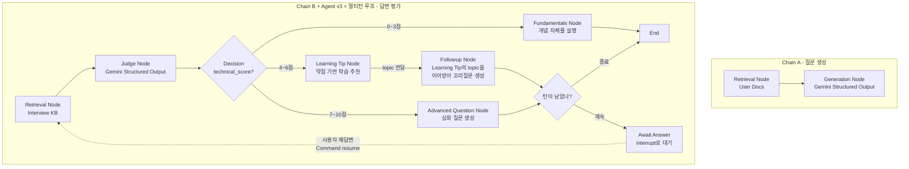

# ai-interview-coach

[](https://github.com/jiyoung720/ai-interview-coach/actions/workflows/ci.yml)

사용자의 이력서·포트폴리오 문서를 기반으로 개인화된 기술 면접 질문을 생성하고, 답변을 평가하는 RAG 기반 AI 면접 코치 서비스입니다.

> 단순히 RAG를 구현하는 데 그치지 않고, Retrieval·Faithfulness·Judge Calibration을 실험으로 검증하며 설계를 반복 개선했습니다. LangGraph 기반 Agent로 확장한 뒤에도 동일한 검증 방식을 유지했습니다. (자세한 진행 상황은 [Project Outcomes](#project-outcomes) 참고)

## Why this project?

이 프로젝트는 GPT-style Transformer를 PyTorch로 직접 구현한 [`korean-chatbot`](https://github.com/jiyoung720/korean-chatbot) 프로젝트의 후속작입니다.

- **`korean-chatbot`**: LLM 엔진 내부(Transformer, 토크나이저, 학습 루프)를 직접 구현하는 경험
- **`ai-interview-coach`**: 기성 LLM(Gemini API)을 활용해 실제 서비스를 설계·구축·서빙·평가하는 경험

두 프로젝트를 함께 보면 "모델 내부를 이해하는 능력"과 "실제 서비스를 만드는 능력"을 둘 다 보여줄 수 있도록 의도적으로 분리했습니다.

### Why RAG, not fine-tuning?

사용자마다 업로드하는 문서가 다르고 계속 바뀌기 때문에, 매번 파인튜닝하는 건 비용·시간 면에서 현실적이지 않습니다. 그래서 모델 가중치는 고정하고, 사용자 문서를 Vector DB에 저장한 뒤 검색해서 Gemini에 컨텍스트로 제공하는 구조로 설계했습니다. 이 구조는 사용자가 늘어나도 그대로 확장되고, 어떤 질문이 어떤 문서에서 나왔는지도 추적할 수 있습니다.

## Example Output

**질문 생성**
```bash
curl -X POST http://127.0.0.1:8000/generate-question \
  -H "Content-Type: application/json" \
  -d '{"query": "JWT 관련 경험"}'
```
```json
{"questions": ["FastAPI의 비동기(async/await) 처리 방식이 ...", "JWT를 이용한 사용자 인증을 구현할 때 ...", "..."]}
```

**답변 평가 + Agent 분기 (technical_score 구간에 따라 서로 다른 코칭을 반환)**
```bash
curl -X POST http://127.0.0.1:8000/evaluate-answer \
  -H "Content-Type: application/json" \
  -d '{"question": "JWT란 무엇인가?", "answer": "잘 모르겠습니다."}'
```
```json
{
  "deductions": [
    { "reason": "JWT에 대해 전혀 알지 못한다고 답변하여 기술적 개념을 설명하지 못했습니다.", "points": 10 }
  ],
  "technical_score": 0,
  "completeness_score": 0,
  "level": "junior",
  "improvements": ["JWT의 개념과 구성 요소(Header, Payload, Signature)에 대한 학습이 필요합니다.", "..."],
  "retrieved_sources": ["jwt.md", "oauth.md"],
  "next_action": "fundamentals_explained",
  "concept_explanation": {
    "concept": "JWT (JSON Web Token)",
    "explanation": "JWT는 사용자 인증 정보를 안전하게 전달하기 위한 토큰 기반 인증 방식입니다. 점(.)으로 구분된 Header, Payload, Signature 세 부분으로 구성됩니다. ...",
    "key_points": ["Header/Payload/Signature 3단 구조", "..."]
  },
  "learning_tip": null,
  "followup_question": null,
  "advanced_question": null
}
```

0점이라 개념 자체를 모르는 상태로 판단해, 학습 방향 제시(Learning Tip) 대신 **개념 설명**을 반환했습니다. 같은 질문에 부분적으로만 맞는 답변(5점)을 보내면 `learning_tip` + `followup_question`이, 정확한 답변(10점)을 보내면 `advanced_question`(심화 질문)이 채워집니다. `next_action`으로 어느 경로가 실행됐는지 알 수 있습니다.

`deductions`는 10점 만점에서 무엇 때문에 얼마나 깎였는지를 담습니다. points의 합은 항상 `10 - technical_score`와 일치하며, 17개 케이스로 확인한 결과 100% 지켜졌습니다. 점수만 주면 "왜 이 점수인지" 알 수 없다는 문제 때문에 넣었습니다.

4~6점 경로에서는 `learning_tip.topic`과 `followup_question`이 같은 주제를 겨냥합니다. Learning Tip이 먼저 핵심 약점을 정하고 Followup이 그 결과를 이어받기 때문입니다. 두 노드를 병렬로 두면 같은 약점을 각자 다르게 해석할 위험이 있어 순차로 설계했습니다.

## Architecture


```mermaid
flowchart TB
    subgraph ChainA["Chain A - 질문 생성"]
        A1[Retrieval Node<br/>User Docs] --> A2[Generation Node<br/>Gemini Structured Output]
    end
    subgraph ChainB["Chain B + Agent v3 + 멀티턴 루프 - 답변 평가"]
        B1[Retrieval Node<br/>Interview KB] --> B2[Judge Node<br/>Gemini Structured Output]
        B2 --> BD{Decision<br/>technical_score?}
        BD -->|"0~3점"| B6[Fundamentals Node<br/>개념 자체를 설명]
        BD -->|"4~6점"| B3[Learning Tip Node<br/>약점 기반 학습 추천]
        B3 -->|"topic 전달"| B5[Followup Node<br/>Learning Tip의 topic을<br/>이어받아 꼬리질문 생성]
        BD -->|"7~10점"| B7[Advanced Question Node<br/>심화 질문 생성]
        B6 --> B4[End]
        B5 --> BC{"턴이 남았나?"}
        B7 --> BC
        BC -->|"종료"| B4
        BC -->|"계속"| B8[Await Answer<br/>interrupt로 대기]
        B8 -.->|"사용자 재답변<br/>Command resume"| B1
    end
```

**분기 기준은 "갈래를 늘리자"가 아니라 "점수대마다 필요한 코칭이 다르다"였습니다.** 개념을 아예 모르는 사람(0~3점)에게 "이걸 공부하세요"라는 학습 팁은 도움이 되지 않아 개념 설명을 주고, 이미 정확히 답한 사람(7~10점)에게는 보완할 약점이 없으니 코칭 대신 더 깊은 질문을 던집니다. v2까지는 5점 이상이면 아무것도 실행되지 않아 한쪽 경로가 비어 있었습니다.

**점선 사이클이 LangGraph를 쓰는 근거입니다.** 조건부 분기와 순차 실행까지는 LCEL의 `RunnableBranch`로도 됩니다. 하지만 코칭받은 사용자가 다시 답하고 그 답을 또 채점하려면 실행이 되돌아가야 하고, 중간에 사람의 입력을 기다리며 멈췄다 재개해야 합니다(`interrupt` / `Command(resume=...)`). 이건 LCEL로 만들 수 없습니다. 0~3점만 루프에서 빠지는데, 개념을 모르는 사람에게 같은 주제를 다시 묻는 건 코칭이 아니라 압박이라고 봤기 때문에 설명을 주고 세션을 마칩니다.

두 체인 모두 LCEL로 먼저 구현한 뒤, LangGraph StateGraph로 마이그레이션했습니다. Retrieval과 Judge/Generation을 별도 Node로 나눈 덕분에 문제 발생 시 어느 단계인지 바로 특정할 수 있고, 평가 점수에 따른 조건부 분기(Agent)도 Node 단위로 추가할 수 있었습니다. 기존 LCEL 코드(`rag/chains.py`)는 지우지 않고 보존해 마이그레이션 과정 자체를 코드로 남겼습니다.

## Key Findings

"작동한다"가 아니라 "왜 그렇게 작동하는지"를 확인한 것들입니다. 전체 기록은 [실험 로그](docs/experiment_log.md)에 있습니다.

**작은 표본에서 내린 결론은 뒤집힌다**

임베딩 비교에서 5문항일 때는 Gemini Embedding이 우세했는데, 20문항으로 늘리자 `ko-sroberta-multitask`가 Top-1 100%(20/20)로 앞섰습니다. 정반대 결론이었습니다. 그런데 KB를 18개에서 29개 문서로 늘리자 **또 한 번 뒤집혔습니다.** 30문항 기준으로 ko-sroberta 86.7%, Gemini 100%였습니다. KB가 2개 문서일 때 Context Precision이 항상 1.0000이던 것도 같은 이유였습니다. 변별력이 없어서 만점이 나온 것을 성능이 좋다고 읽고 있었습니다.

**문서 분리 단위는 파일 크기가 아니라 "완결된 근거 단위"다**

독립된 개념이 나열된 문서(`postgresql.md`, `spring.md`)는 하위 주제로 쪼갤수록 검색이 좋아졌지만, 비교형 문서(`session_vs_token.md`)는 반대로 정의·차이·확장성을 한 chunk에 묶어야 좋아졌습니다. "잘게 쪼갤수록 좋다"가 아니라 **질문 하나에 답할 근거가 흩어지지 않는 단위**가 기준이었습니다. 이 원칙으로 KB를 재구성해 당시 기준(KB 18개·20문항)으로 Top-1 100%, Faithfulness 0.9708까지 올렸습니다.

**검색이 정확해도 생성이 컨텍스트를 벗어난다**

Retriever가 올바른 근거를 찾아줘도 LLM이 그 밖의 내용을 덧붙이는 것을 관찰했습니다. RAGAS로 재보니 Calibration Set 17개의 평균 Faithfulness가 0.4412였습니다. Retrieval 성공과 생성 충실도는 별개로 측정해야 하는 값입니다.

**채점이 틀렸을 때 의심할 것은 채점자가 아니라 채점기준이었다**

Judge Calibration이 52.9%로 나왔을 때 원인은 Judge가 아니라 **Calibration Set의 설계 결함**(같은 답변에 다른 기대치)이었습니다. 재설계로 94.1%가 됐습니다. Phase 12에서 표본을 44개로 늘렸을 때도 처음엔 51.2%였는데, 이번에도 원인은 제가 붙인 라벨이었습니다. `average`로 분류한 답변에 틀린 내용이 없어 높은 점수가 정상이었던 겁니다. **실패가 한 방향으로만 쏠리면 대상이 아니라 기준을 봐야 합니다.**

**LLM 없이 검증 가능한 계층을 분리해두면 전수 검증이 된다**

분기 함수(`decide_next_step`)가 State만 받는 순수 함수라 0~10점 11개 값을 Gemini 호출 없이 전부 확인할 수 있었습니다. 멀티턴 사이클도 노드를 가짜로 갈아끼우고 **judge 호출 횟수를 세는 방식**으로 증명했습니다. 답변을 두 번 제출했을 때 judge가 2회 불렸다면 실행이 되돌아간 것이니까요. 덕분에 회귀가 가장 나기 쉬운 라우팅·상태 전이가 CI에서 매번 검증됩니다.

**중간 지표가 올라도 최종 지표는 안 움직일 수 있다**

임베딩을 바꿔 검색 Top-1을 86.7%에서 100%로 올렸는데, **채점 정확도는 91.7%에서 90.9%로 사실상 그대로였습니다.** Judge가 답변 자체를 보고 채점하기 때문입니다. Access/Refresh Token 질문에 엉뚱하게 `spring_layered_architecture.md`가 근거로 붙던 상황에서도 해당 케이스들은 전부 정확히 채점됐습니다. 그래도 교체를 유지한 이유는 점수가 아니라 **사용자에게 보이는 근거 출처** 때문입니다. 점수가 맞아도 "N+1 질문에 HTTP 상태 코드 문서 참고"라고 뜨면 신뢰가 무너집니다.

**임베딩이 도메인 용어를 모르면 문서를 고쳐도 소용없다**

"멱등성" 질문이 계속 엉뚱한 문서로 새서 전용 문서를 만들고 제목에 동의어까지 넣었는데 **거리가 0.6969에서 1도 안 움직였습니다.** 단어 쌍을 직접 재보니 `ko-sroberta`에서 "멱등성"과 그 정의의 거리(0.1682)가 무관한 "비동기 처리"(0.4091)보다 **오히려 멀었습니다.** 그때까지 검색 문제는 전부 chunk 분리로 풀어왔는데, 문서를 어떻게 써도 해결되지 않는 종류가 있다는 것을 처음 만났습니다.

**설계의 대가는 측정해야 알 수 있다**

Learning Tip과 Followup을 순차로 둔 것은 두 출력이 같은 주제를 겨냥하게 하려는 선택이었는데, 그 비용은 모르고 있었습니다. 배포 후 재보니 Gemini를 3회 호출하는 구간이 2회인 구간보다 4~6초 느렸습니다. 동시에 기준선(측정 당시 헬스체크였던 `GET /`)이 전체의 0.2% 미만이라 **병목이 서버 연산도 네트워크도 아닌 LLM 응답 대기**임이 드러났습니다. 따라서 인스턴스 사양 상향은 주된 개선 수단이 아니었습니다.

## Tech Stack
 
- **Backend**: FastAPI
- **패키지 관리**: uv
- **Framework**: LangChain (LCEL) → LangGraph (StateGraph) 마이그레이션
- **Vector DB**: Chroma (`hnsw:space=cosine`), Interview KB 29개 문서 54 chunk (retrieval unit 기준으로 재구성)
- **Embedding**: KB 검색은 Gemini Embedding(`gemini-embedding-001`), 업로드 문서 검색은 `ko-sroberta-multitask`(로컬). 두 인덱스를 나란히 유지해 비교 실험이 가능하다
- **LLM**: Gemini 3.5 Flash (structured output)
- **Evaluation**: Semantic Retrieval Test, Judge Calibration Set(v1 17개 / v2 44개), RAGAS Faithfulness(Calibration Set 기준 평균 0.4412), Retrieval 전용 평가셋(30문항: Top-1 100%·Faithfulness 0.9702·Context Precision 1.0000), Embedding 비교(KB 29개·30문항 기준: Gemini 100%/0.9702 > ko-sroberta 86.7%/0.8931. KB 18개·20문항 시점에는 결론이 반대였음)

## Project Outcomes

**RAG 파이프라인**
- LCEL로 먼저 구현한 뒤 LangGraph StateGraph로 마이그레이션. 기존 코드를 보존해 과정 자체를 남김
- Retrieval / Judge / Generation을 독립 Node로 분리해 문제 발생 지점을 특정 가능하게 설계
- 문서 분리 전략을 "완결된 근거 단위"로 재설계해 Top-1 100%·Faithfulness 0.9708 달성 (KB 18개·20문항 시점)
- KB를 29개로 확장한 뒤 임베딩을 재비교해 Gemini Embedding으로 교체, 30문항 기준 Top-1 100%·Faithfulness 0.9702 확보

**Agent와 멀티턴**
- 점수 구간별 3분기(개념 설명 / 약점 코칭 / 심화 질문)로 확장해 모든 점수대에서 결과가 나오도록 개선
- 그래프에 사이클을 도입해 멀티턴 루프 구현(`interrupt` / `Command(resume)`). "왜 LCEL이 아니라 LangGraph인가"에 구조로 답함
- 라우팅을 순수 함수로 분리해 LLM 호출 없이 0~10점 전 구간과 루프 동작을 전수 검증

**평가 체계**
- Judge Calibration Set으로 채점 신뢰도를 검증하고, 이를 마이그레이션 회귀 테스트로 재사용
- RAGAS(Faithfulness, Context Precision)를 도입하고 KB 규모가 지표 변별력에 미치는 영향을 확인
- 두 임베딩을 동일 KB에 인덱싱해 비교하는 파이프라인 구축. 표본을 늘리자 결론이 뒤집힘
- Calibration Set을 44개로 확대하고 판정 기준을 점수 범위에서 **코칭 경로 일치**로 전환. 반복 측정으로 변동 폭(약 5%p)을 확보해 이후 개선의 유의미성을 판정할 기준선 마련

**서빙과 운영**
- Docker 패키징·CI/CD·EC2 배포에 단일 페이지 프론트엔드까지 붙여 업로드부터 코칭까지 동작하는 서비스로 완성
- 배포한 서버를 응답 시간·프로세스 상태·패킷 세 계층에서 관찰해 "응답 지연의 원인은 LLM 대기"를 교차 검증 ([분석 보고서](#문서))

## API

### `POST /documents`
사용자 문서를 업로드해 User Docs 컬렉션에 인덱싱합니다. `.md`, `.txt`, `.pdf`를 지원하며, PDF는 `pypdf`로 텍스트를 추출합니다.
```bash
curl -X POST http://127.0.0.1:8000/documents -F "file=@tests/fixtures/sample_user_doc.md"
```

### `POST /generate-question`
```bash
curl -X POST http://127.0.0.1:8000/generate-question \
  -H "Content-Type: application/json" \
  -d '{"query": "JWT 관련 경험"}'
```
응답: `{"questions": ["...", "...", ...]}`

### `POST /evaluate-answer`
```bash
curl -X POST http://127.0.0.1:8000/evaluate-answer \
  -H "Content-Type: application/json" \
  -d '{"question": "JWT란 무엇인가?", "answer": "..."}'
```
응답: `{"deductions": [{"reason": "...", "points": N}], "technical_score": ..., "completeness_score": ..., "level": "junior" | "middle" | "senior", "strengths": [...], "improvements": [...], "overall_feedback": "...", "retrieved_sources": [...], "next_action": "...", "concept_explanation": {...} | null, "learning_tip": {...} | null, "followup_question": "..." | null, "advanced_question": {...} | null}`

`level`은 지원자의 연차가 아니라 그 답변 하나가 보여준 수준입니다. 트레이드오프까지 설명하면 `senior`, 개념과 동작 원리를 정확히 설명하면 `middle`, 개념은 알지만 표면적이면 `junior`입니다.

`technical_score` 구간에 따라 셋 중 하나의 경로만 실행되고, 나머지 필드는 `null`입니다.

| 점수 | `next_action` | 채워지는 필드 |
|---|---|---|
| 0~3 | `fundamentals_explained` | `concept_explanation` (concept, explanation, key_points) |
| 4~6 | `followup_generated` | `learning_tip` (topic, reason, recommended_sections) + `followup_question` |
| 7~10 | `advanced_question_generated` | `advanced_question` (question, intent) |

`followup_question`은 `learning_tip.topic`을 이어받아 동일 주제를 겨냥합니다.

### `POST /interview/start` · `POST /interview/answer`
멀티턴 세션입니다. 위 `/evaluate-answer`가 단발성이라면, 이쪽은 코칭을 받은 뒤 다시 답하는 흐름을 최대 3턴까지 이어갑니다.

```bash
# 세션 시작 (session_id 발급)
curl -X POST http://127.0.0.1:8000/interview/start \
  -H "Content-Type: application/json" \
  -d '{"question": "JWT란 무엇인가?", "answer": "토큰 기반 인증 방식입니다."}'

# 받은 next_question에 답해 다음 턴 진행
curl -X POST http://127.0.0.1:8000/interview/answer \
  -H "Content-Type: application/json" \
  -d '{"session_id": "...", "answer": "..."}'
```

응답에는 `turn`, `status`(`awaiting_answer` | `completed`), `next_question`, `end_reason`, 그리고 지난 턴 기록인 `history`가 함께 담깁니다. 종료된 세션에 답변을 보내면 409, 없는 세션이면 404입니다.

실제 실행 예시로, 한 세션에서 점수가 8 → 9 → 10으로 오르며 질문이 "JWT란 무엇인가" → "LocalStorage와 Cookie 저장의 취약점" → "HttpOnly 쿠키의 Cross-Origin 전송"으로 점점 깊어졌습니다. 심화 질문이 직전 답변을 전제로 생성되기 때문입니다.

> 세션은 `MemorySaver`에 보관되므로 서버를 재시작하면 진행 중이던 세션이 사라집니다. 단일 인스턴스 데모 기준이며, 영속화가 필요하면 `SqliteSaver`로 교체하면 됩니다.

## 실행 방법

### 로컬
```bash
uv sync
cp .env.example .env  # GEMINI_API_KEY 채우기
uv run uvicorn app.main:app --reload
```
브라우저에서 `http://127.0.0.1:8000/` 로 접속하면 데모 화면(업로드 → 질문 생성 → 면접 진행)을 쓸 수 있습니다. 프론트는 순수 HTML/CSS/JS 단일 페이지(`static/`)이고 FastAPI가 직접 서빙합니다.

마지막 단계는 **대화형**입니다. 답변을 제출하면 평가와 코칭이 타임라인에 쌓이고, 이어지는 꼬리질문·심화질문에 다시 답하며 최대 3턴까지 면접이 진행됩니다.

### Docker
```bash
cp .env.example .env  # GEMINI_API_KEY 채우기
docker compose up -d
```
최초 기동 시 Interview KB가 자동으로 인덱싱되고(29개 문서, 54 chunk), 이후 재시작에서는 volume에 남아 있는 인덱스를 그대로 사용합니다. `chroma_db`와 업로드 파일은 volume에 보존되며, `GEMINI_API_KEY`는 이미지에 포함되지 않고 런타임에 주입됩니다.

이미지는 CPU 전용 torch를 사용해 3.79GB입니다(amd64 기준 2.7GB). 기본 설정으로 빌드하면 배포 대상에 없는 GPU용 CUDA 스택이 3.5GB가량 포함되어 10.9GB가 되는데, 이를 Dockerfile 안에서만 걷어냈습니다. 로컬(macOS)과 Colab(GPU 사용) 환경은 영향을 받지 않도록 `pyproject.toml`은 수정하지 않았습니다.

### CI/CD

`main` 브랜치에 푸시하면 GitHub Actions가 다음을 자동 수행합니다.

```
push → test (회귀 테스트 35개) → docker-build (빌드 + 검증 + Docker Hub push) → deploy (EC2가 이미지를 받아 재기동)
```

- **test**: 분기 로직, 그래프 구조, chunking 등 Gemini API 키가 필요 없는 계층만 검증합니다. 비밀값을 CI에 노출하지 않기 위한 설계이며, 마침 회귀가 가장 나기 쉬운 부분(Agent 분기)이 이 범위에 들어옵니다.
- **docker-build**: 깨끗한 환경(linux/amd64)에서 빌드하고, CUDA 패키지가 다시 섞이면 실패 처리합니다. 실제로 CPU torch 최적화가 에러 없이 적용되지 않았던 적이 있어 자동 검사로 고정했습니다. 스모크 테스트까지 통과한 이미지만 Docker Hub에 올리며, `latest`와 커밋 SHA 두 태그를 답니다.
- **deploy**: 앞의 두 job이 통과한 경우에만 실행됩니다(`needs`). EC2는 빌드하지 않고 Docker Hub에서 이미지를 받아 재기동한 뒤, 외부에서 헬스체크로 실제 응답까지 확인합니다.

빌드 위치를 EC2에서 CI로 옮긴 이유는 두 가지입니다. 맥(arm64)에서 `--platform linux/amd64`로 빌드하면 QEMU 에뮬레이션이 임베딩 모델 로드 단계에서 멈춰 실패했고(두 번 재현), EC2에서 빌드하면 `t3.small`의 CPU와 디스크를 배포마다 소모합니다. GitHub Actions 러너는 네이티브 amd64라 두 문제가 함께 해소됩니다. 커밋 SHA 태그를 함께 달아두면 문제가 생겼을 때 특정 커밋 이미지로 되돌릴 수 있습니다.

## 문서

- [프로젝트 명세서](docs/project_spec_v1.md): Phase별 상세 진행 상황(Roadmap) 포함
- [실험 로그](docs/experiment_log.md)
- 분석 보고서
  - [과제 1. 유닉스 프로세스·스레드·메모리 분석](docs/reports/01_unix_process_analysis.md)
  - [과제 2. WireShark HTTP 통신 캡처·분석](docs/reports/02_wireshark_http_capture.md)