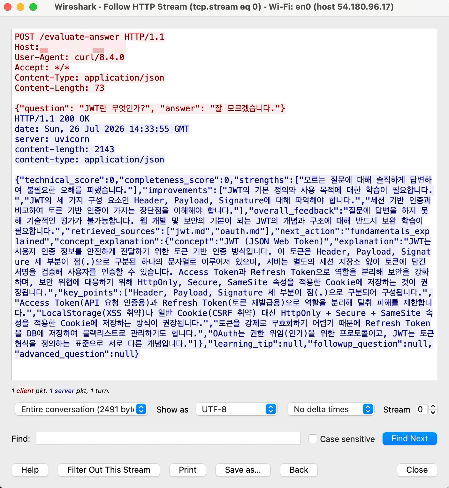
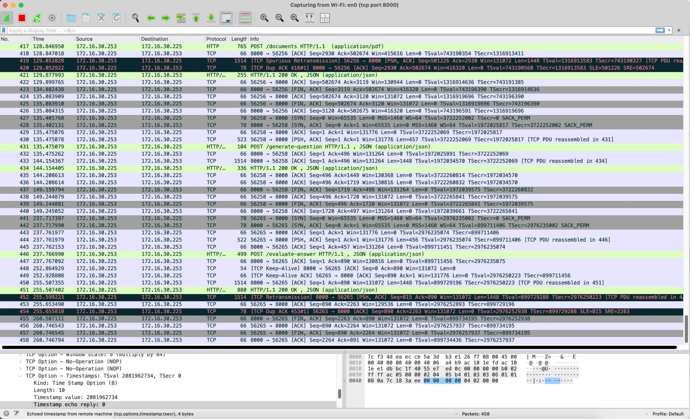
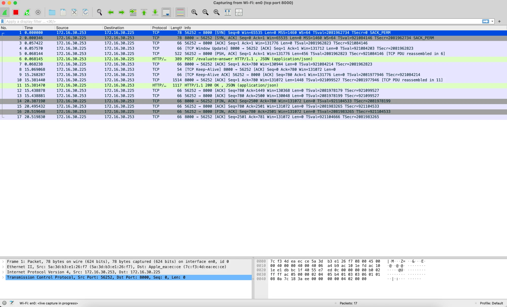

# 과제 2. WireShark HTTP 통신 캡처·분석 보고서

> 대상 서비스: `ai-interview-coach` (RAG 기반 AI 면접 코치, FastAPI + Docker)
> 캡처 도구: WireShark (macOS, Wi-Fi 인터페이스 `en0`)
> 과제 조건: 클라이언트가 서버와 다른 컴퓨터에 있을 것

---

## 1. 배경과 캡처 구성

HTTP 통신을 캡처하려면 클라이언트와 서버가 서로 다른 컴퓨터여야 한다. 본 과제에서는 이 조건을 **두 가지 서로 다른 구성**으로 충족하여, 각각에서 관찰되는 통신 특성을 비교했다.

| 케이스 | 클라이언트 | 서버 | 경로 |
|---|---|---|---|
| 1 | 로컬 노트북 (macOS) | AWS EC2 (서울 리전) | 인터넷 |
| 2 | 스마트폰 | 노트북 (로컬 서버) | 동일 Wi-Fi |

케이스 1은 서버가 물리적으로 원격(클라우드 데이터센터)에 있어 인터넷을 거치는 통신이고, 케이스 2는 같은 Wi-Fi 안의 두 기기 사이 통신이다. 두 경우 모두 "클라이언트와 서버가 다른 컴퓨터" 조건을 만족한다.

WireShark 캡처 필터로 대상 트래픽만 격리했다.
- 케이스 1: `host <EC2 IP>`
- 케이스 2: `tcp port 8000`

---

## 2. 케이스 1: 노트북 → EC2 서버 (원격, 인터넷 경유)

`POST /evaluate-answer` 요청 1건의 전 과정을 13개 패킷으로 캡처했다.

### 요청 하나의 생애

| 패킷 | 시각(초) | 내용 |
|---|---|---|
| 1~3 | 0.000 ~ 0.009 | TCP 3-way handshake (SYN → SYN,ACK → ACK) |
| 4 | 0.009 | HTTP POST 요청 (JSON, 평문) |
| 5 | 0.016 | 서버의 요청 수신 ACK |
| (침묵) | 0.016 ~ 17.206 | **약 17.19초간 데이터 패킷 없음** |
| 6~8 | 17.206 | HTTP 200 OK 응답 (JSON) + TCP 재전송 |
| 9~13 | 17.206 ~ 17.214 | ACK, FIN (연결 종료) |

### 관찰 2-1. TCP 3-way handshake
HTTP 요청을 보내기 전, 패킷 1~3에서 반드시 SYN → SYN,ACK → ACK의 3번 왕복으로 연결을 먼저 수립했다. 이 handshake는 약 9ms만에 끝났다. 이 값은 노트북과 서울 EC2 사이의 순수 네트워크 왕복 시간(RTT)에 해당한다.

### 관찰 2-2. HTTP 평문 노출
WireShark의 Follow HTTP Stream 기능으로 요청·응답 전체를 확인한 결과, **모든 내용이 평문으로 그대로 노출**됐다.
- 요청: `POST /evaluate-answer`, `Host`, `User-Agent`, `Content-Type`, 그리고 body의 질문·답변 JSON
- 응답: `server: uvicorn`, `content-length`, 그리고 채점 결과 JSON 전체

한글이 ASCII 뷰에서 `.`으로 보인 것은 암호화가 아니라 인코딩 표시의 문제였다. UTF-8 뷰로 전환하면 한글 원문이 그대로 드러났다. 즉 **HTTP는 중간에서 패킷을 캡처한 제3자가 요청·응답 내용을 그대로 읽을 수 있다.** 만약 이것이 로그인 요청이었다면 비밀번호가 평문으로 노출됐을 것이다. 이것이 실무에서 HTTPS(TLS)로 통신을 암호화하는 이유이며, 본 캡처는 그 필요성을 실측으로 보여준다.

> **[그림 1] Follow HTTP Stream (UTF-8)** : 요청 JSON과 응답 JSON(한글 코칭 전체)이 평문으로 노출된 화면.

### 관찰 2-3. TCP 재전송 (신뢰성 메커니즘)
응답 데이터를 전송하는 과정에서 `[TCP Retransmission]`과 `[TCP Dup ACK]`가 관측됐다. 패킷이 유실되거나 순서가 어긋나자 TCP가 자동으로 재전송하여 복구한 것이다. 이 과정에서 애플리케이션 코드(FastAPI)는 아무것도 인지하지 못했다. TCP 계층이 조용히 처리했기 때문이다. "TCP는 신뢰성 있는 전송"이라는 개념이 실제 캡처에 나타난 사례다.

---

## 3. 케이스 2: 스마트폰 → 노트북 로컬 서버 (동일 Wi-Fi)

스마트폰을 노트북과 같은 Wi-Fi에 연결하고, 노트북의 IP(`172.16.30.225:8000`)로 접속하여 서비스 전 과정(문서 업로드 → 질문 생성 → 답변 평가)을 수행했다. 클라이언트는 스마트폰(`172.16.30.253`), 서버는 노트북(`172.16.30.225`)이다.

### 관찰 3-1. 서비스 전체 흐름이 세 개의 세션으로
스마트폰이 세 번의 요청을 보냈고, 각각 **서로 다른 클라이언트 포트**의 독립된 TCP 세션으로 관리됐다.

| 요청 | 엔드포인트 | Content-Type | 클라이언트 포트 |
|---|---|---|---|
| POST /documents | 문서 업로드 | application/pdf | 56256 |
| POST /generate-question | 질문 생성 | application/json | 56258 |
| POST /evaluate-answer | 답변 평가 | application/json | 56265 |

각 요청이 별도의 TCP 세션으로 열리고(SYN handshake) 닫히는(FIN) 것을 확인했다. 서버는 (클라이언트 IP, 클라이언트 포트, 서버 IP, 서버 포트) 조합으로 각 연결을 구분해 관리한다.

> **[그림 3] 폰 캡처 전체 흐름** : `POST /documents`(패킷 417), `POST /generate-question`(431), `POST /evaluate-answer`(446)이 각각 다른 포트 세션으로 처리되는 화면. Source가 172.16.30.253(폰)과 172.16.30.225(노트북)로 나뉘어 "다른 컴퓨터" 조건을 보여준다.

### 관찰 3-2. 파일 업로드의 TCP 세그먼트 분할
`POST /documents`(PDF 업로드) 구간에서, 클라이언트가 **1514바이트 크기의 TCP 패킷을 여러 개 연속으로** 전송하는 것이 관측됐다. JSON 요청(질문·답변)은 데이터가 작아 패킷 한두 개로 끝나지만, PDF 파일은 크기 때문에 여러 세그먼트로 나뉘어 전송된다. WireShark는 이들을 `[TCP PDU reassembled in ...]`로 표시하며, 여러 조각이 하나의 HTTP 메시지로 재조립됨을 보여준다.

### 관찰 3-3. TCP Keep-Alive
답변 평가 요청(약 15초 소요) 도중, 응답이 오래 걸리는 동안 `[TCP Keep-Alive]`와 `[TCP Keep-Alive ACK]` 패킷이 관측됐다. 이는 오랜 침묵 동안 연결이 아직 살아있는지 확인하는 신호로, 케이스 1의 "17초 침묵" 구간과 같은 상황(LLM 대기)에서 연결을 유지하기 위한 TCP의 동작이다.

> **[그림 2] 폰의 단일 요청 캡처** : `POST /evaluate-answer`(패킷 6) 이후 15초 대기 구간에서 `[TCP Keep-Alive]`(패킷 8)와 `[TCP Keep-Alive ACK]`(패킷 9)가 관측된 화면.

---

## 4. 두 케이스 비교

| 항목 | 케이스 1 (노트북 → EC2) | 케이스 2 (폰 → 노트북) |
|---|---|---|
| 경로 | 인터넷 (원격) | 동일 Wi-Fi (근거리) |
| Handshake RTT | 약 9ms | 근거리라 더 짧음 |
| 관측된 특징 | 평문 노출, 재전송, 17초 침묵 | 파일 분할 전송, Keep-Alive, 다중 세션 |
| 공통 | TCP handshake, LLM 대기 구간, HTTP 평문 | |

두 구성 모두에서 공통적으로 (1) 통신 전 TCP 연결 수립, (2) LLM 응답 대기로 인한 긴 침묵, (3) HTTP 평문 전송이 확인됐다. 서로 다른 네트워크 경로(원격/근거리)와 서로 다른 클라이언트(노트북/스마트폰)에서 동일한 프로토콜 동작을 관찰함으로써, 이 특성들이 특정 환경이 아니라 프로토콜 자체의 성질임을 확인했다.

---

## 5. 결론

1. **지연의 원인을 네트워크 레벨에서 규명했다.** 요청-응답 사이의 긴 침묵(패킷 부재)은 지연이 네트워크나 전송이 아니라 서버의 외부 API 대기 때문임을 증명한다. 이는 과제 1의 프로세스 상태 관찰(S 상태)과 정확히 일치하며, 두 과제가 같은 사실을 서로 다른 계층에서 교차 검증한 셈이다.
2. **HTTP의 평문 노출을 육안으로 확인했다.** 캡처한 제3자가 요청·응답 내용을 그대로 읽을 수 있음을 시연했고, 이것이 HTTPS가 필요한 이유임을 실측 근거로 확보했다.
3. **TCP의 동작(handshake, 재전송, Keep-Alive, 세그먼트 분할)**을 실제 서비스 트래픽에서 관찰했다. 교과서의 개념들이 자신의 서버 통신에 그대로 나타나는 것을 확인했다.
